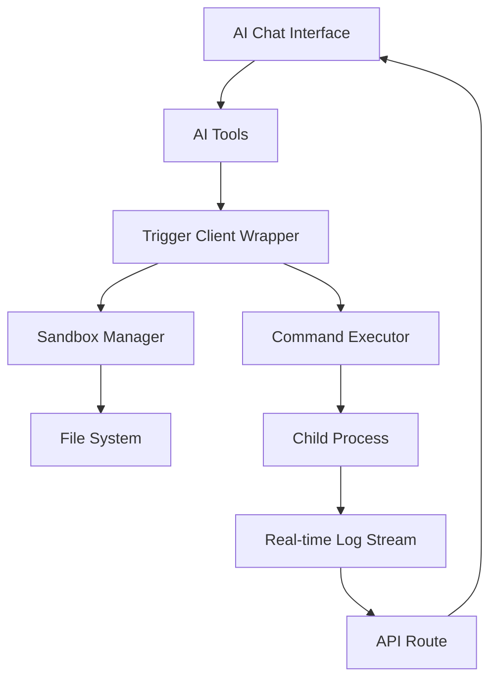

# Trigger.dev Integration for Vibe Coding Platform

This document explains how the Vercel Sandbox execution layer has been replaced with Trigger.dev workflows while maintaining the same user experience.

## 🎯 Overview

The original Vibe Coding Platform used Vercel's `@vercel/sandbox` package to create isolated environments for code execution. This integration replaces that with a **local sandbox execution system** that can be extended to use Trigger.dev for cloud-based execution.

## 🏗️ Architecture

### Key Components

1. **Sandbox Manager** (`trigger/sandbox-manager.ts`)
   - Creates isolated working directories for each sandbox
   - Manages sandbox lifecycle and cleanup
   - Provides file system operations (read/write/list)

2. **Command Executor** (`trigger/command-executor.ts`)
   - Executes commands within sandbox environments
   - Captures stdout/stderr in real-time
   - Streams logs as they're generated
   - Supports both blocking and non-blocking execution

3. **Trigger Client Wrapper** (`lib/trigger-client.ts`)
   - Provides a drop-in replacement for `@vercel/sandbox`
   - Maintains API compatibility with the original implementation
   - Exports `Sandbox` and `Command` classes with identical interfaces

4. **Trigger.dev Tasks** (`trigger/index.ts`)
   - Defines tasks for sandbox operations (create, execute, logs)
   - Can be deployed to Trigger.dev cloud for distributed execution
   - Currently runs locally but ready for cloud deployment

### How It Works



## 🔄 Replacing Vercel Sandbox

### Before (Vercel Sandbox)
```typescript
import { Sandbox } from '@vercel/sandbox'

const sandbox = await Sandbox.create({ timeout: 600000 })
const command = await sandbox.runCommand({ cmd: 'npm', args: ['install'] })
```

### After (Trigger.dev Integration)
```typescript
import { Sandbox } from '@/lib/trigger-client'

const sandbox = await Sandbox.create({ timeout: 600000 })
const command = await sandbox.runCommand({ cmd: 'npm', args: ['install'] })
```

**The API is identical!** All existing AI tools continue to work without modification to their core logic.

## 🚀 Setup & Installation

### 1. Install Dependencies

The Trigger.dev SDK has been added to the project:

```bash
npm install @trigger.dev/sdk
```

### 2. Local Development

For local development, no Trigger.dev account is needed. The sandbox runs directly on your machine:

```bash
npm run dev
```

The sandbox system will:
- Create temporary directories in `os.tmpdir()/vibe-sandboxes/`
- Execute commands using Node.js `child_process`
- Stream logs in real-time to the frontend
- Clean up after the configured timeout

### 3. Cloud Deployment with Trigger.dev (Optional)

To deploy the sandbox execution to Trigger.dev cloud:

1. **Sign up for Trigger.dev**
   - Visit https://trigger.dev/
   - Create a new project
   - Copy your project ID and API key

2. **Configure Environment Variables**
   ```bash
   TRIGGER_PROJECT_ID=your_project_id
   TRIGGER_API_KEY=your_api_key
   ```

3. **Deploy Tasks**
   ```bash
   npm run trigger:deploy
   ```

4. **Update Trigger Client** (optional)
   
   Modify `lib/trigger-client.ts` to use remote task execution instead of local:
   ```typescript
   import { tasks } from "@trigger.dev/sdk/v3";
   
   // In TriggerSandbox.create()
   const result = await tasks.trigger("create-sandbox", { timeout, ports });
   ```

## 📁 File Structure

```
vibe-coding-platform/
├── trigger/
│   ├── index.ts                    # Trigger.dev task definitions
│   ├── sandbox-manager.ts          # Sandbox lifecycle management
│   └── command-executor.ts         # Command execution & logging
├── lib/
│   └── trigger-client.ts           # API-compatible wrapper
├── ai/
│   └── tools/
│       ├── create-sandbox.ts       # Updated to use trigger-client
│       ├── run-command.ts          # Updated to use trigger-client
│       ├── generate-files.ts       # Updated to use trigger-client
│       └── get-sandbox-url.ts      # Updated to use trigger-client
├── app/
│   └── api/
│       └── sandboxes/
│           └── [sandboxId]/
│               └── cmds/
│                   └── [cmdId]/
│                       └── logs/
│                           └── route.ts  # Updated log streaming
└── trigger.config.ts               # Trigger.dev configuration
```

## 🔧 Key Features

### Real-time Log Streaming

Commands output logs in real-time using async generators:

```typescript
async *logs(): AsyncGenerator<LogLine> {
  // Yields logs as they're produced
  for await (const log of streamCommandLogs(cmdId)) {
    yield log;
  }
}
```

The frontend receives these through the `/api/sandboxes/[sandboxId]/cmds/[cmdId]/logs` endpoint.

### Sandbox Isolation

Each sandbox gets:
- Unique working directory
- Isolated environment variables
- Automatic cleanup after timeout
- File system operations scoped to its directory

### Command Execution

Supports:
- **Blocking execution**: Wait for command to finish, get full output
- **Detached execution**: Start command in background, stream logs
- **Multiple commands**: Each runs in the sandbox's working directory
- **Error handling**: Captures stderr and exit codes

### File Operations

```typescript
// Write files
await sandbox.writeFiles([
  { path: 'index.js', content: 'console.log("Hello")' },
  { path: 'package.json', content: '{"name": "demo"}' }
]);

// Read files
const files = await sandbox.readFiles(['index.js', 'package.json']);
```

## 🧪 Testing

Start the development server:

```bash
npm run dev
```

Then test the integration:

1. **Create a sandbox**
   - Ask the AI: "Create a new sandbox"
   - Verify a sandbox ID is returned

2. **Generate files**
   - Ask: "Create a simple Node.js app with Express"
   - Verify files are written to the sandbox

3. **Run commands**
   - Ask: "Install dependencies and start the server"
   - Verify real-time logs appear
   - Check that the process runs successfully

4. **Get sandbox URL**
   - Ask: "What's the URL for port 3000?"
   - Verify it returns `http://localhost:3000`

## 🔒 Security Considerations

### Current Implementation (Local)
- Sandboxes run on the same machine as the application
- Uses Node.js child processes with limited permissions
- Working directories are isolated but share the same OS
- Suitable for development and trusted environments

### Production Recommendations
- Deploy to Trigger.dev cloud for true isolation
- Use containerized execution (Docker/Kubernetes)
- Implement rate limiting and resource quotas
- Add authentication and authorization
- Monitor sandbox usage and costs

## 📊 Differences from Vercel Sandbox

| Feature | Vercel Sandbox | This Integration |
|---------|---------------|------------------|
| **Execution** | Cloud-based | Local or Trigger.dev cloud |
| **Isolation** | Full VM/container | Process + directory isolation |
| **Setup** | Requires Vercel account | Works out of the box |
| **Cost** | Pay per use | Free (local) or Trigger.dev pricing |
| **Network** | Public URLs provided | Localhost (local) or custom |
| **Scalability** | Auto-scales | Depends on host machine |
| **API** | Proprietary | Open and extensible |

## 🎯 Design Decisions

1. **API Compatibility**: Maintained the same API as `@vercel/sandbox` to minimize code changes
2. **Local-First**: Made it work without external dependencies for easy development
3. **Cloud-Ready**: Structured with Trigger.dev tasks for easy cloud deployment
4. **Real-time Logs**: Implemented streaming with async generators for live feedback
5. **Modular Architecture**: Separated concerns (sandbox management, command execution, client wrapper)

## 🚀 Deployment Guide

### Deploy to Vercel

```bash
# Install Vercel CLI
npm i -g vercel

# Deploy
vercel --prod
```

### Environment Variables

Set these in your Vercel project settings or `.env.local`:

```bash
# Optional: Trigger.dev (for cloud execution)
TRIGGER_PROJECT_ID=your_project_id
TRIGGER_API_KEY=your_api_key

# Required: AI Provider API keys
OPENAI_API_KEY=your_openai_key
# or
ANTHROPIC_API_KEY=your_anthropic_key
```

## 📝 Additional Notes

### Timeout Management
- Default timeout: 10 minutes (600,000 ms)
- Maximum timeout: 45 minutes (2,700,000 ms)
- Sandboxes auto-cleanup after timeout
- Commands can be killed manually if needed

### Port Exposure
- Specified when creating sandbox
- Used for web servers, APIs, etc.
- Currently maps to localhost in local mode
- Can be configured for cloud deployment

### Error Handling
- All operations wrapped in try-catch
- Rich error messages with context
- Errors propagated to AI for debugging
- Failed sandboxes cleaned up automatically

## 🤝 Contributing

When extending this integration:

1. Keep API compatibility with Vercel Sandbox
2. Add tests for new features
3. Update this documentation
4. Consider both local and cloud execution modes
5. Maintain real-time streaming capabilities

## 📚 References

- [Trigger.dev Documentation](https://trigger.dev/docs)
- [Original Vercel Vibe Demo](https://oss-vibe-coding-platform.vercel.app/)
- [Vercel Sandbox Docs](https://vercel.com/docs/vercel-sandbox)
- [Project Repository](https://github.com/vercel/examples/tree/main/apps/vibe-coding-platform)

---

**Built with ❤️ using Trigger.dev and Next.js**

